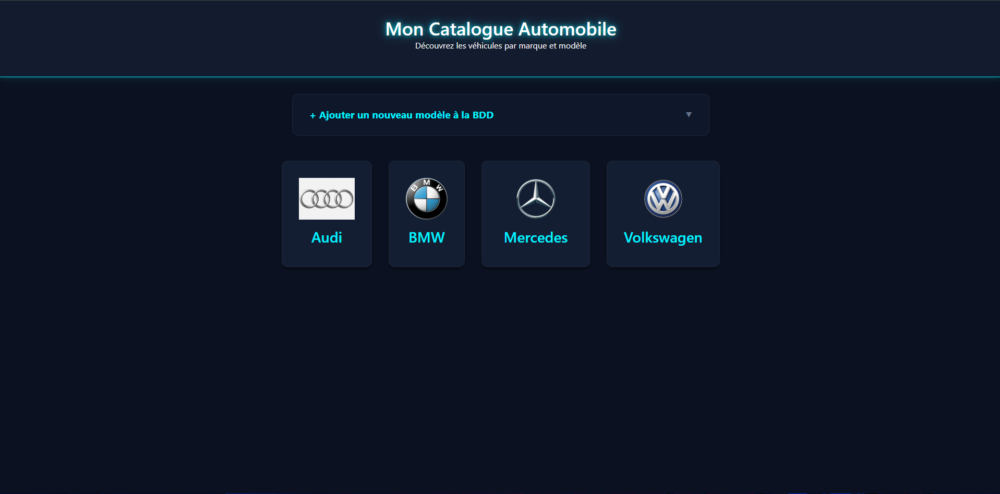
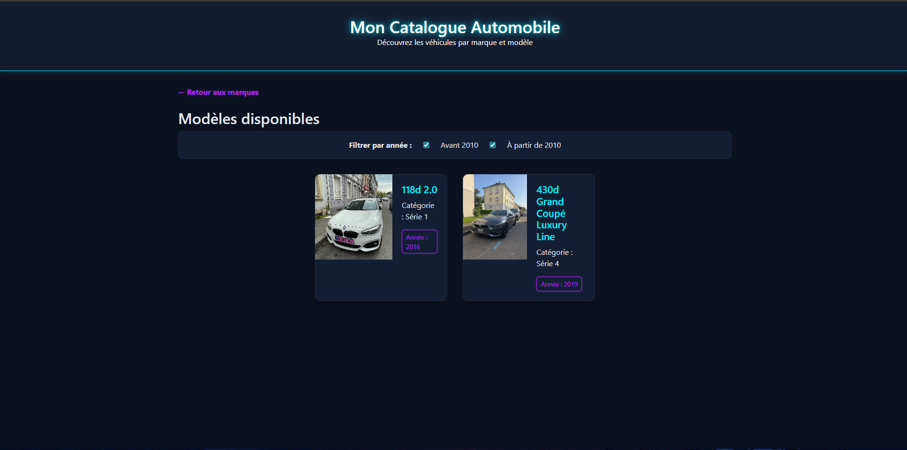

#  Catalogue Automobile - SAE 203

Site web dynamique de consultation et de gestion de véhicules, développée dans le cadre d'un projet universitaire (SAE) au sein du BUT MMI (Métiers du Multimédia et de l'Internet)**.

##  Fonctionnalités
- Affichage dynamique : Récupération et affichage des marques et modèles de voitures en temps réel depuis une base de données.
- Requêtes SQL optimisées : Utilisation de jointures (`INNER JOIN`) pour lier les modèles, les marques et les images secondaires.
- Page Détail : Affichage complet des caractéristiques d'un véhicule sélectionné avec une galerie d'images secondaires.

##  Technologies utilisées
- **Back-end :** PHP / MySQL
- **Front-end :** HTML5 / CSS3 / JavaScript
- **Environnement de développement :** Laragon / Git / Visual Studio Code

## Aperçu du projet

##  Installation locale (Laragon)
1. Cloner ce dépôt GitHub.
2. Placer le dossier dans votre répertoire `www` de Laragon.
3. Importer la base de données (fichier `.sql`) dans votre outil de gestion de BDD (ex: phpMyAdmin).
4. Configurer la connexion dans le fichier `connexion.php`.